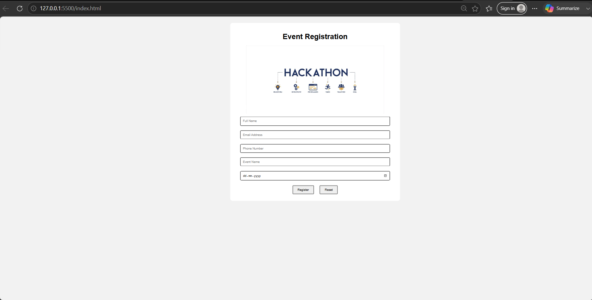

# Ex09 Event Registration Web Application
## Date:

## AIM:
To design, develop and deploy a web application for event registration.

## DESIGN STEPS:

### Step 1:
Create a new frame.

### Step 2:
Select any one preset size of your choice.

### Step 3:
Select the shapes you need.

### Step 4:
Import images as needed.

### Step 5:
Create pages based on your need and link them.

### Step 6:

Validate the HTML and CSS code.

### Step 6:

Publish the website in the given URL.

## DESIGN TOOL:
Figma

## CODE:
index.html
```
<!DOCTYPE html>
<html>
<head>
    <title>Event Registration</title>
    <link rel="stylesheet" href="style.css">
</head>
<body>

<div class="container">

    <h1>Event Registration</h1>

    

    <form>

        <input type="text" placeholder="Full Name" required>

        <input type="email" placeholder="Email Address" required>

        <input type="tel" placeholder="Phone Number" required>

        <input type="text" placeholder="Event Name" required>

        <input type="date" required>

        <button>Register</button>
        <button type="reset">Reset</button>

    </form>

</div>

</body>
</html>
```
style.css
```
body{
    font-family: Arial, sans-serif;
    background:#f2f2f2;
}

.container{
    width:700px;
    margin:auto;
    text-align:center;
    background:white;
    padding:20px;
    margin-top:30px;
    border-radius:10px;
}

input{
    width:90%;
    padding:10px;
    margin:10px;
}

button{
    padding:10px 20px;
    margin:10px;
}
```


## OUTPUT:
  


## RESULT:
The program to design, develop and deploy a web application for event registration is completed successfully.
